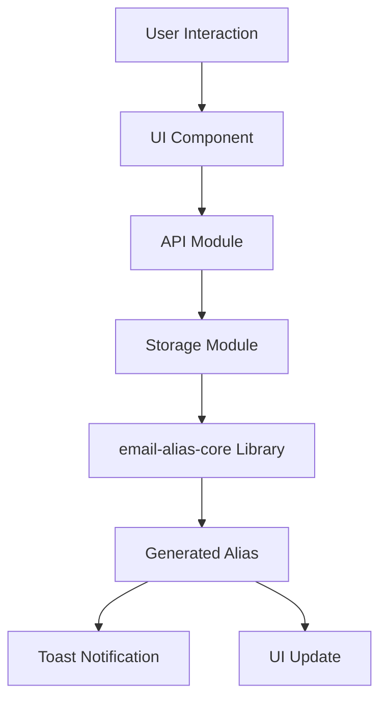
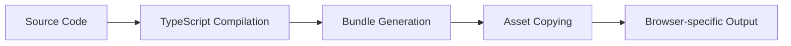

# Email Alias Extensions - Architecture Documentation

## Overview

The Email Alias Extensions project is a TypeScript-based monorepo that provides browser extensions for Chrome and Firefox. The extensions enable users to generate secure, cryptographic email aliases using their custom domains.

## Project Structure

See the [root `README.md`](../../../README.md) for the project structure.

## Core Architecture

### 1. Monorepo Structure

The project uses a monorepo approach with pnpm workspaces to share common code between Chrome and Firefox extensions while maintaining browser-specific configurations.

**Benefits:**

- Single source of truth for shared logic
- Consistent build and development processes
- Easy cross-browser testing and maintenance

### 2. TypeScript Foundation

All source code is written in TypeScript, providing:

- Compile-time type safety
- Enhanced IDE support
- Better refactoring capabilities
- Reduced runtime errors

### 3. Module System

The codebase is organized into focused modules:

#### Core Modules

- **`api.ts`**: Central API for email alias generation
- **`storage.ts`**: Browser storage abstraction layer
- **`background.ts`**: Service worker for background operations
- **`toast.ts`**: User notification system

#### UI Modules

- **`popup.ts`**: Main extension popup interface
- **`options.ts`**: Configuration and settings page
- **`content.ts`**: Content script containing email field detection

#### Utility Modules

- **`background-alias-generator.ts`**: Background-specific alias generation
- **`domain.ts`**: Domain parsing and validation utilities

## Component Architecture

### 1. Email Alias Generation Flow



#### Process Steps:

1. **User Input**: User provides label and source through UI
2. **Validation**: Input validation and sanitization
3. **Settings Retrieval**: Load domain and secret key from storage
4. **Cryptographic Generation**: Use email-alias-core for secure generation
5. **Result Handling**: Display result and provide user feedback

### 2. Background Service Worker

The background script handles:

- **Keyboard Shortcuts**: Global shortcut handling
- **Context Menus**: Right-click menu integration
- **Cross-tab Communication**: Message passing between components
- **Auto-fill Functionality**: Detecting and filling email fields

### 3. Storage Architecture

```typescript
interface Settings {
  domain: string; // User's custom domain
  token: string; // Secret cryptographic key
  defaultLabel: string; // Default alias label
}
```

**Storage Strategy:**

- Uses browser.storage.sync for cross-device synchronization
- Encrypted storage for sensitive data
- Graceful fallback mechanisms

### 4. Error Handling Strategy

#### Layered Error Handling:

1. **Input Validation**: Front-end validation with immediate feedback
2. **API Error Handling**: Centralized error processing in API module
3. **User Notifications**: Toast notifications for error communication
4. **Fallback Mechanisms**: Graceful degradation when features unavailable

#### Custom Error Types:

```typescript
class ApiError extends Error {
  constructor(message: string) {
    super(message);
    this.name = "ApiError";
  }
}
```

## CSS Architecture

### Modular CSS System

The CSS is organized into focused modules for maintainability:

#### Core Modules:

- **`variables.css`**: CSS custom properties and design tokens
- **`base.css`**: Typography, reset, and fundamental styles
- **`layout.css`**: Grid, flexbox utilities, and responsive design

#### Component Modules:

- **`forms.css`**: Form elements and validation states
- **`buttons.css`**: Button variants and interactions
- **`components.css`**: Reusable UI components
- **`toast.css`**: Toast notification styling

#### Feature Modules:

- **`popup.css`**: Extension popup specific styles
- **`shortcuts.css`**: Keyboard shortcut interface styles

### Design System

#### Color System:

- CSS custom properties for theming
- Automatic dark/light mode detection
- High contrast mode support

#### Responsive Design:

- Mobile-first approach
- Flexible layouts for different screen sizes
- Touch-friendly interactive elements

## Security Architecture

### 1. Cryptographic Security

- **Secret Key Management**: Secure random key generation using Web Crypto API
- **Key Storage**: Browser storage with user-controlled backup
- **Alias Generation**: Cryptographic algorithms from email-alias-core library

### 2. Data Protection

- **No External Requests**: All processing happens locally
- **Minimal Permissions**: Only necessary browser permissions requested
- **Secure Storage**: Encrypted storage for sensitive configuration

### 3. Input Validation

```typescript
// Example validation flow
function validateInput(aliasParts: string[]): void {
  if (!aliasParts || aliasParts.length !== 2) {
    throw new ApiError("Invalid input: exactly two parts required");
  }

  if (aliasParts.some((part) => !part || part.trim() === "")) {
    throw new ApiError("Both Label and Source fields are required");
  }
}
```

## Testing Strategy

### 1. Test Organization

```
__tests__/
├── api.test.ts                        # API functionality tests
├── api.integration.test.ts            # Integration tests with email-alias-core
├── background-alias-generator.test.ts # Background processing tests
├── background.test.ts                 # Background worker tests
├── content.test.ts                    # Content script tests
├── domain.test.ts                     # Domain processing tests
├── options.test.ts                    # Options page tests
├── popup.test.ts                      # Extension popup tests
└── storage.test.ts                    # Storage abstraction tests
```

### 2. Testing Approach

#### Unit Tests:

- **Isolated Testing**: Each module tested in isolation
- **Mock Dependencies**: External dependencies mocked for predictable tests
- **Edge Cases**: Comprehensive coverage of error conditions

#### Integration Tests:

- **Real Library Integration**: Tests with actual email-alias-core library
- **End-to-End Workflows**: Complete user interaction flows
- **Cross-browser Compatibility**: Browser-specific functionality testing

#### Test Tools:

- **Vitest**: Modern test runner with TypeScript support
- **JSDOM**: DOM simulation for UI testing
- **Browser Mocking**: webextension-polyfill for browser API simulation

## Build System

### 1. Build Process



#### Build Steps:

1. **TypeScript Compilation**: Source code compilation with type checking
2. **Module Bundling**: ESBuild for efficient bundling
3. **Asset Processing**: Copy static assets (HTML, CSS, icons)
4. **Browser Packaging**: Generate browser-specific distributions

### 2. Development Workflow

```bash
# Development commands
pnpm run type-check    # TypeScript validation
pnpm run lint          # Code quality checks
pnpm run test          # Run test suite
pnpm run format        # Code formatting
pnpm run build         # Production build
```

## Performance Considerations

### 1. Bundle Optimization

- **Tree Shaking**: Eliminate unused code
- **Code Splitting**: Separate bundles for different components
- **Asset Optimization**: Compressed and optimized static assets

### 2. Runtime Performance

- **Lazy Loading**: Load components only when needed
- **Efficient DOM Operations**: Minimal DOM manipulation
- **Memory Management**: Proper cleanup and resource management

### 3. User Experience

- **Fast Startup**: Quick extension initialization
- **Responsive UI**: Immediate feedback for user actions
- **Offline Capability**: Core functionality works without network

## Browser Compatibility

### Chrome (Manifest V3)

- Service Workers for background processing
- Modern JavaScript APIs
- Enhanced security model

### Firefox (Manifest V2/V3)

- Background scripts compatibility
- Cross-browser polyfills
- Firefox-specific API adaptations

## Future Architecture Considerations

### 1. Scalability

- **Plugin Architecture**: Extensible plugin system for new features
- **API Versioning**: Backward-compatible API evolution
- **Configuration Management**: Advanced settings and preferences

### 2. Enhanced Security

- **Hardware Security Keys**: Integration with WebAuthn
- **Multi-factor Authentication**: Additional security layers
- **Audit Logging**: Security event tracking

### 3. User Experience

- **Sync Across Devices**: Cloud-based settings synchronization
- **Advanced UI**: Rich interface components
- **Accessibility**: Enhanced accessibility features

## Conclusion

The Email Alias Extensions architecture provides a solid foundation for secure, maintainable, and extensible browser extensions. The modular design, comprehensive testing, and security-first approach ensure reliable operation across different browsers while maintaining high code quality and user experience standards.
